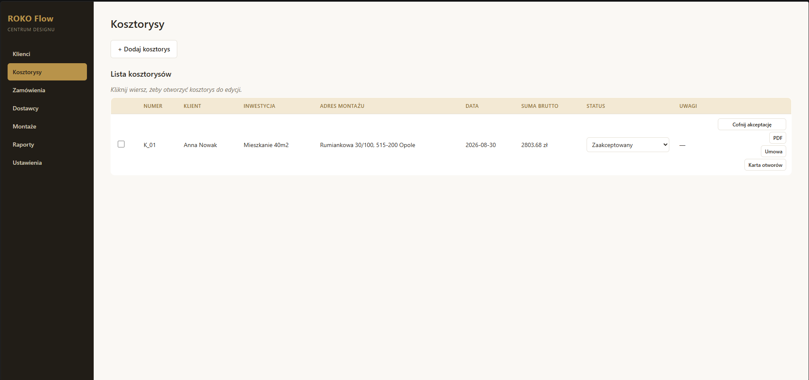
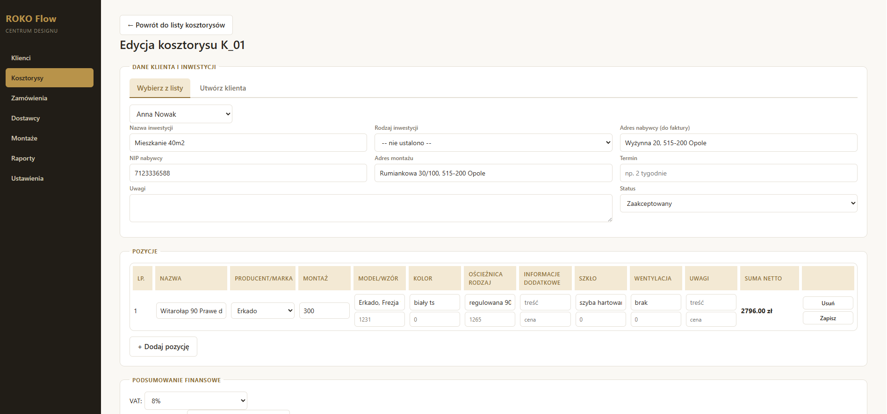
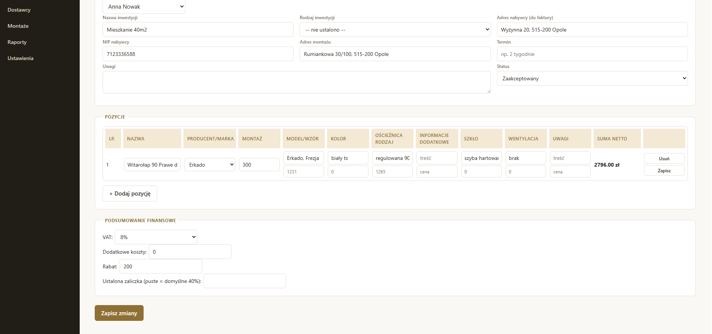
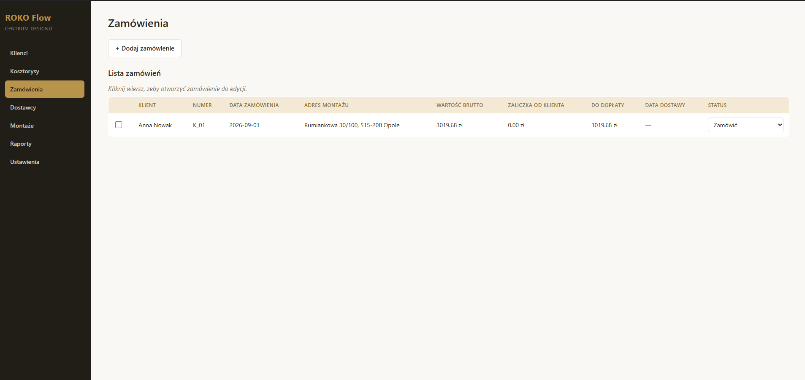
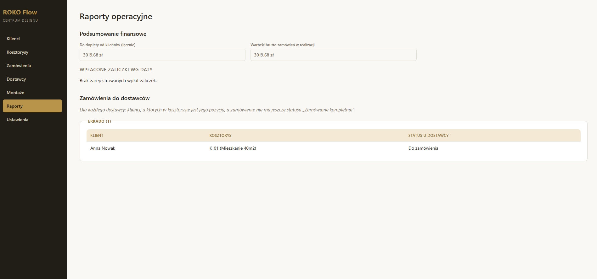
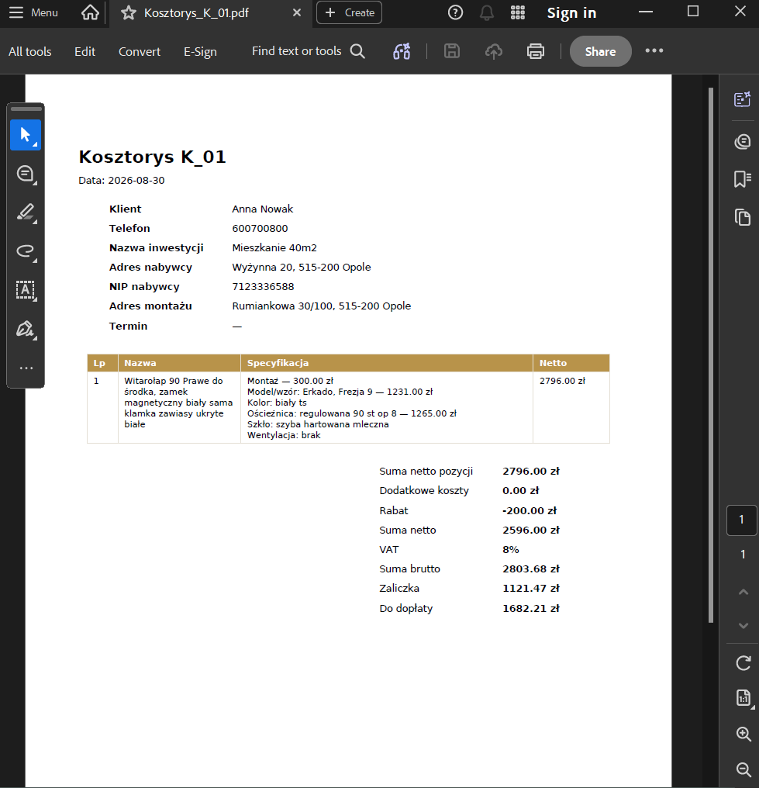

# ROKO Flow


🔗 **[Zobacz działające demo](https://ikangela.github.io/roko-flow/)** — wersja pokazowa z przykładowymi, fikcyjnymi danymi (bez logowania). Backend hostowany na darmowym planie, może "obudzić się" nawet minutę po dłuższej przerwie.

Aplikacja do zarządzania procesem sprzedaży i montażu stolarki budowlanej (drzwi, okna, klamki, rolety, bramy garażowe): od kosztorysu, przez zamówienie u dostawcy, aż po montaż u klienta.

Firma ROKO prowadzi ten proces w Arkuszach Google, wspomaganych skryptami, które automatyzują sporo pracy. Działa to sprawnie, ale ma dwie słabe strony: nie wygląda zbyt atrakcyjnie i każda nowa oferta wymaga skopiowania całego skoroszytu od nowa. ROKO Flow zastępuje to pełną aplikacją webową z bazą danych.

## Funkcje

- **Klienci**: kartoteka klientów z wyszukiwarką i edycją.
- **Kosztorysy**: wycena inwestycji z dynamicznymi pozycjami (drzwi, okna, klamki i inne), każda pozycja z własnymi składnikami kosztu (towar, montaż, podfrezowanie itd.) i przypisanym dostawcą/marką. Automatyczne wyliczanie VAT, rabatu, zaliczki i kwoty do dopłaty.
- **Dostawcy**: prosta lista producentów/dostawców ze specyfikacją asortymentu.
- **Zamówienia**: generowane z zaakceptowanego kosztorysu, z możliwością utworzenia zamówienia niezależnego (np. serwisowego). Dane uzupełniane progresywnie w miarę ustaleń z dostawcą.
- **Montaże**: harmonogram realizacji, powiązany z kosztorysem/inwestycją.
- Zaznaczanie i usuwanie zbiorcze na każdej liście, z zabezpieczeniem przed usunięciem rekordów posiadających powiązania (np. klienta z istniejącymi kosztorysami).

## Stos technologiczny

- Backend: Python, FastAPI, SQLAlchemy (ORM), SQLite, Pydantic
- Frontend: React, Vite, React Router

## Architektura

Backend zbudowany w warstwach, z rozdzieleniem odpowiedzialności:

```
app/
├── routers/       # obsługa żądań HTTP
├── services/      # logika biznesowa (wyliczenia, walidacje)
├── repositories/  # dostęp do bazy danych (wzorzec Repository)
├── models/        # definicje tabel SQLAlchemy
└── schemas/       # kontrakty API (Pydantic)
```

Zastosowane wzorce projektowe: Repository (odseparowanie logiki od sposobu przechowywania danych), Service Layer (reguły biznesowe oddzielone od warstwy HTTP), Dependency Injection (wstrzykiwanie zależności przez `Depends()` w FastAPI).

Frontend jako SPA (Single Page Application) komunikujące się z backendem przez REST API, z widokami list/formularzy współdzielącymi wspólne wzorce (zaznaczanie zbiorcze, edycja pełnoekranowa, siatki pól z podpisami).

## Uruchomienie lokalne

**Backend:**
```bash
python -m venv venv
source venv/Scripts/activate  # Windows (Git Bash)
pip install -r requirements.txt
uvicorn app.main:app --reload --port 8000
```

**Frontend:**
```bash
cd frontend
npm install
npm run dev
```

Frontend: http://localhost:5173 · API i interaktywna dokumentacja: http://localhost:8000/docs

## Zrzuty ekranu

**Lista kosztorysów** — status do zmiany bezpośrednio z listy, przyciski do pobrania kosztorysu, umowy i karty otworów jako PDF.



**Edycja kosztorysu** — dane klienta i inwestycji, pozycje z cenami przypisanymi do każdej kolumny (model, kolor, ościeżnica, szkło itd.).



**Edycja kosztorysu** — dalszy ciąg: pozycje i automatycznie wyliczane podsumowanie finansowe (VAT, rabat, zaliczka, do dopłaty).



**Lista zamówień** — wartości i status liczone/zmieniane wprost z listy.



**Raporty operacyjne** — podsumowanie finansowe firmy i zestawienie, którzy klienci czekają na zamówienie u danego dostawcy.



**Wygenerowany PDF kosztorysu** — dokument do pobrania bezpośrednio z listy, z danymi firmy uzupełnianymi w Ustawieniach.


